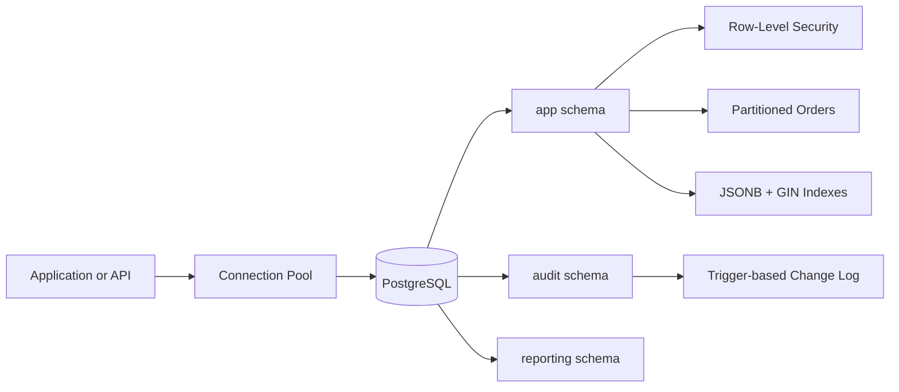

# Architecture

TenantForge is a PostgreSQL reference implementation for a multi-tenant SaaS order platform.

Each business row includes `tenant_id`. The application sets `app.current_tenant_id` for the current database session, and PostgreSQL row-level security policies enforce tenant isolation.
