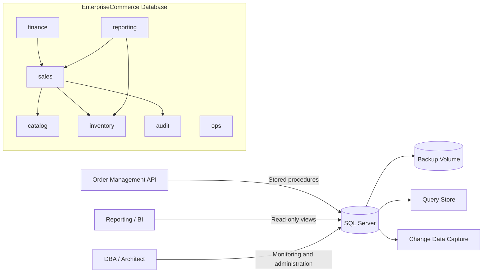

# Architecture

## Production reference architecture

The local Docker deployment is a single-node development lab. A production design
would normally place SQL Server on dedicated infrastructure, use Availability
Groups or a managed SQL platform for high availability, separate data/log/backup
storage, integrate enterprise identity, encrypt connections, centralize secrets,
ship audit logs to a SIEM, and test backup restoration regularly.
