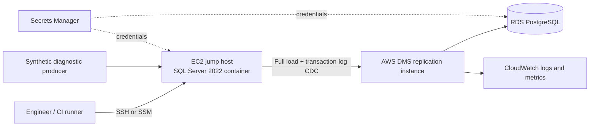
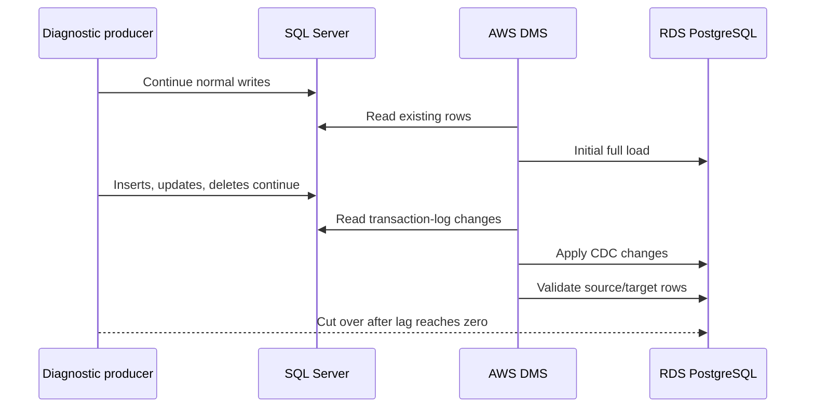

# SQL Server to PostgreSQL Migration with AWS DMS

A portfolio-ready migration lab that demonstrates a heterogeneous database migration from **SQL Server on Amazon EC2** to **Amazon RDS for PostgreSQL** using **AWS Database Migration Service (AWS DMS)**.

> All clinical records are synthetic. The project contains no real PHI or PII.

## What this project demonstrates

- SQL Server-to-PostgreSQL compatibility assessment and schema remediation
- Infrastructure as code for the source, target, networking, DMS, encryption, and monitoring
- AWS DMS **full load plus change data capture (CDC)**
- Explicit table-selection and schema-transformation rules
- DMS row-level validation plus independent business validation
- Cutover, rollback, stabilization, and decommissioning runbooks
- SQL Server and PostgreSQL application-code conversion examples
- A repeatable panel-interview demonstration

## Target architecture



The databases and DMS replication instance are placed inside one VPC. SQL Server accepts port 1433 from DMS and, optionally, from the administrator CIDR. PostgreSQL accepts port 5432 from DMS and the SQL Server/jump-host security group. RDS is not publicly accessible.

## Migration sequence



## Repository map

| Folder | Purpose |
|---|---|
| `database/sqlserver` | Source schema, T-SQL objects, CDC preparation, and demo changes |
| `database/postgresql` | Version-controlled converted target schema and PostgreSQL functions |
| `schema-conversion` | Assessment checklist, compatibility matrix, and manual remediation log |
| `terraform` | VPC, EC2 SQL Server host, RDS PostgreSQL, DMS, KMS, secrets, and alarms |
| `dms` | Table mappings, task settings, and PowerShell operational scripts |
| `generator` | Synthetic transplant-diagnostics workload |
| `validation` | Independent cross-database validation |
| `docs` | Deployment, migration, cutover, rollback, security, and panel walkthroughs |
| `legacy-local-simulation` | Previous Python full-load/CDC proof of concept; not the primary AWS path |

## Visual walkthroughs

- [View the deployed architecture and migration evidence](docs/migration-evidence.md)
- [Follow the complete end-to-end migration workflow](docs/complete-workflow.md)

## Prerequisites

- AWS account and an AWS CLI profile
- Terraform 1.6+
- PowerShell 7+
- Python 3.11+
- AWS CLI v2
- Microsoft ODBC Driver 18 for SQL Server
- `psql` client or DBeaver for PostgreSQL administration
- An SSH key pair already created in the selected AWS Region

## 1. Configure the project

```powershell
Copy-Item terraform/terraform.tfvars.example terraform/terraform.tfvars
```

Edit `terraform/terraform.tfvars`:

```hcl
aws_region       = "us-west-2"
project_name     = "transplant-dms-lab"
admin_cidr       = "YOUR.PUBLIC.IP/32"
ec2_key_name     = "YOUR_EXISTING_KEY_PAIR"
sqlserver_password = "Use-A-Strong-Lab-Password!123"
postgres_password  = "Use-A-Different-Strong-Password!123"
```

Credentials supplied to Terraform are marked sensitive but are still stored in Terraform state. Use an encrypted remote backend and restricted access for anything beyond a disposable lab.

## 2. Deploy AWS infrastructure

```powershell
cd terraform
terraform init
terraform fmt -check
terraform validate
terraform plan
terraform apply
```

The deployment creates:

- Two Availability Zone VPC layout
- EC2 source/jump host running SQL Server 2022 Developer in Docker
- Private RDS PostgreSQL target with encryption and automated backups
- DMS replication subnet group and replication instance
- Source and target DMS endpoints
- Full-load-and-CDC DMS task
- CloudWatch logging and CDC latency alarms
- Secrets Manager entries for lab credentials

Terraform creates the DMS task but does **not** start it automatically. This lets you prepare and validate both database schemas first.

## 3. Bootstrap SQL Server

Get the EC2 address:

```powershell
terraform output sqlserver_public_ip
```

Wait for the SQL Server container to become healthy, then apply:

```text
1. database/sqlserver/001_create_database.sql
2. database/sqlserver/002_source_schema.sql
3. database/sqlserver/003_prepare_for_dms_cdc.sql
```

Use SQL Server Management Studio, Azure Data Studio, DBeaver, or `sqlcmd`. The source scripts create deliberate SQL Server-specific features such as `UNIQUEIDENTIFIER`, `DATETIME2`, `BIT`, `NVARCHAR(MAX)`, `ROWVERSION`, `TOP`, and T-SQL stored procedures.

## 4. Create the PostgreSQL target schema

Connect through an SSH tunnel using the EC2 host as the jump host:

```powershell
ssh -i C:\path\key.pem -L 5433:<RDS_ENDPOINT>:5432 ubuntu@<EC2_PUBLIC_IP>
```

Then apply the converted target schema through `localhost:5433`:

```powershell
psql --host localhost --port 5433 `
  --username postgres `
  --dbname transplant_diagnostics `
  --file database/postgresql/001_target_schema.sql
```

The target schema is pre-created and version controlled. DMS is configured with `DO_NOTHING` target preparation so it loads rows into the converted schema instead of attempting to design it.

## 5. Generate source data

Create a local `.env` from the example and point it to the EC2 public IP:

```powershell
Copy-Item .env.example .env
py -m venv .venv
.\.venv\Scripts\Activate.ps1
py -m pip install -r requirements.txt
py -m generator.generate_data --cases 500 --results 50000
```

## 6. Test DMS endpoint connectivity

```powershell
.\dms\scripts\test-endpoints.ps1 -TerraformDirectory .\terraform
```

Both endpoint tests must report `successful` before the task starts.

## 7. Run the premigration assessment

```powershell
.\dms\scripts\start-assessment.ps1 -TerraformDirectory .\terraform
```

Review the results in the AWS DMS console before starting the migration. Record findings under `schema-conversion/assessment-report/`.

## 8. Start full load plus CDC

```powershell
.\dms\scripts\start-task.ps1 -TerraformDirectory .\terraform
```

Monitor task and table statistics:

```powershell
.\dms\scripts\monitor-task.ps1 -TerraformDirectory .\terraform
```

While the full load is running, continue generating writes:

```powershell
py -m generator.generate_data --cases 10 --results 1000
```

You can also run the insert/update/delete examples in `database/sqlserver/004_demo_cdc_changes.sql` and verify that they reach PostgreSQL.

## 9. Validate the migration

DMS row-level validation is enabled in `dms/tasks/task-settings.json`. Run the independent validation layer as well:

```powershell
py -m validation.run_validation
```

The independent checks cover:

- Row counts
- Primary-key uniqueness
- Foreign-key integrity
- Null and date-range comparisons
- Aggregate diagnostic totals
- JSON validity
- Insert/update/delete CDC markers

## 10. Rehearse cutover

Follow `docs/cutover-runbook.md`. The go/no-go criteria are:

- Full load complete for every selected table
- No tables in error
- DMS validation has no unresolved failures
- `CDCLatencySource` and `CDCLatencyTarget` are near zero
- Independent validation passes
- Application compatibility and smoke tests pass
- Rollback decision owner is present

## Useful commands

```powershell
# Show Terraform outputs
terraform -chdir=terraform output

# Stop the task
.\dms\scripts\stop-task.ps1 -TerraformDirectory .\terraform

# Resume the task
.\dms\scripts\start-task.ps1 -TerraformDirectory .\terraform -StartType resume-processing

# Destroy the lab to stop charges
terraform -chdir=terraform destroy
```

For a guarded teardown that displays the active AWS identity and every
Terraform-managed resource before destruction, run:

```powershell
.\scripts\teardown-aws.ps1
```

The script requires typing `DESTROY` before it invokes Terraform. For unattended
lab automation, pass `-AutoApprove`. It does not delete the pre-existing EC2 key
pair or local files because those are not managed by this Terraform state.

## Production caveats intentionally represented

- AWS DMS migrates table data; schema conversion and database code are managed separately.
- DMS does not maintain PostgreSQL sequence values during ongoing replication. Reset sequences after replication stops if identity/sequence-backed columns are used.
- Secondary indexes and foreign keys can affect full-load speed. This lab pre-creates key indexes for CDC correctness; production loading strategy should be benchmarked.
- DMS validation consumes additional source, target, and network capacity.
- SQL Server transaction-log retention must be monitored so DMS does not lose required CDC records.
- The lab uses broad source privileges for simplicity. Production should use AWS-documented least-privilege permissions.

## Interview framing

> I built an intentionally SQL Server-specific source and converted the target schema separately because AWS DMS is a data-movement service, not a complete application-conversion tool. I use DMS for a full load followed by transaction-log CDC, keep both endpoints private inside the VPC, enable row-level DMS validation, and add independent business validation. Before cutover I drain writes, confirm CDC latency is near zero, run final validation, reset any target sequences, switch the application, and retain SQL Server as a controlled rollback point.
