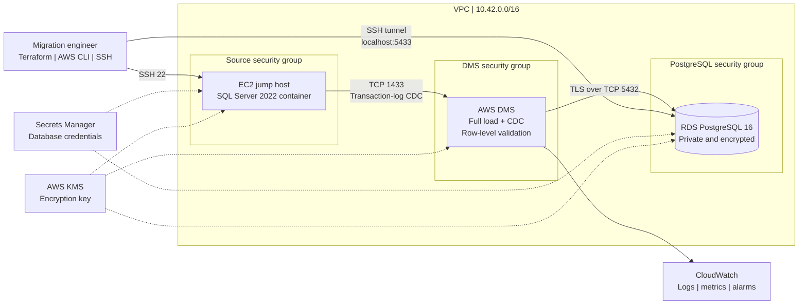

# AWS architecture

The lab uses SQL Server 2022 Developer Edition in a container on EC2 as the self-managed source and Amazon RDS for PostgreSQL as the target. AWS DMS performs the initial full load and then reads SQL Server transaction-log changes for CDC.

See [Migration architecture and evidence](../docs/migration-evidence.md) for screenshots from the deployed lab.

## Network flow

- Administrator → EC2: SSH 22 and optional SQL Server 1433 from a single CIDR.
- DMS security group → EC2 source security group: TCP 1433.
- DMS security group → RDS target security group: TCP 5432.
- EC2 source/jump security group → RDS target security group: TCP 5432.
- RDS and DMS are not publicly accessible.

## Security controls represented

- KMS encryption for EBS, RDS, DMS storage, and Secrets Manager.
- TLS required on the PostgreSQL DMS endpoint.
- RDS backups and PostgreSQL log export enabled.
- CloudWatch alarms for source and target CDC latency.
- Synthetic data classification tags.

The source endpoint uses a broad SQL Server account for lab simplicity. Production should replace it with the AWS-documented least-privilege model and formal credential rotation.
