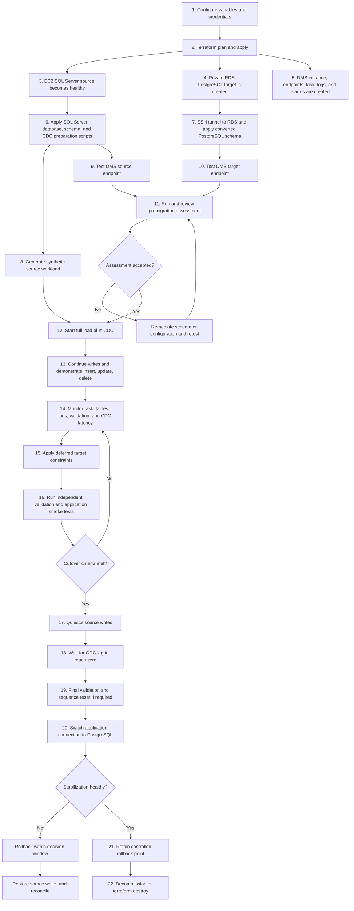

# Complete migration workflow

This is the primary AWS workflow for the repository. The code under `legacy-local-simulation/` is a historical proof of concept, not part of the production-shaped path below.



## Phase-by-phase ownership and evidence

| Phase | Repository implementation | Completion evidence |
|---|---|---|
| Configure | `terraform/terraform.tfvars.example`, `.env.example` | Variables populated locally; secrets absent from Git |
| Provision | `terraform/*.tf` | Terraform outputs exist; EC2, RDS, DMS, KMS, Secrets Manager, logs, and alarms are healthy |
| Prepare source | `database/sqlserver/001_create_database.sql` through `003_prepare_for_dms_cdc.sql` | Source objects exist and DMS CDC prerequisites pass |
| Convert target | `database/postgresql/001_target_schema.sql`, `schema-conversion/` | Converted schemas, tables, indexes, and functions exist |
| Seed workload | `generator/generate_data.py` | Synthetic source row counts are nonzero |
| Qualify endpoints | `dms/scripts/test-endpoints.ps1` | Both DMS endpoint tests report `successful` |
| Assess | `dms/scripts/start-assessment.ps1`, `schema-conversion/assessment-checklist.md` | Findings reviewed, accepted, or remediated |
| Migrate | `dms/tasks/table-mappings.json`, `task-settings.json`, `start-task.ps1` | All selected tables finish full load and CDC remains active |
| Exercise CDC | `database/sqlserver/004_demo_cdc_changes.sql` | Insert, update, and delete markers appear on PostgreSQL |
| Observe | `monitor-task.ps1`, CloudWatch logging and alarms | No table errors; source and target latency trend toward zero |
| Harden target | `database/postgresql/002_post_full_load_constraints.sql` | Deferred constraints apply successfully |
| Validate | DMS validation plus `validation/run_validation.py` | No unresolved row or business-rule discrepancies |
| Cut over | `docs/cutover-runbook.md` | Writes are drained, lag is zero, final checks pass, application uses PostgreSQL |
| Recover if needed | `docs/rollback-runbook.md` | Application returns to SQL Server and divergent writes are reconciled |
| Stabilize and close | Cutover/security runbooks and Terraform | Monitoring window completes; rollback point is retired; chargeable lab resources are destroyed |

## Operational command path

```powershell
# Provision
terraform -chdir=terraform init
terraform -chdir=terraform plan
terraform -chdir=terraform apply

# Prepare schemas using DBeaver, sqlcmd, or psql in numeric script order.
# Then generate synthetic data.
.\.venv\Scripts\Activate.ps1
py -m generator.generate_data --cases 500 --results 50000

# Qualify and migrate
.\dms\scripts\test-endpoints.ps1 -TerraformDirectory .\terraform
.\dms\scripts\start-assessment.ps1 -TerraformDirectory .\terraform
.\dms\scripts\start-task.ps1 -TerraformDirectory .\terraform
.\dms\scripts\monitor-task.ps1 -TerraformDirectory .\terraform

# Validate
py -m validation.run_validation

# Stop charges only after the lab evidence has been captured
terraform -chdir=terraform destroy
```

## Decision gates

- Do not start migration until both endpoint tests succeed and assessment findings are dispositioned.
- Do not cut over until every selected table has completed full load, there are no unresolved validation failures, CDC latency is near zero, and application smoke tests pass.
- Preserve SQL Server as the rollback authority during the agreed stabilization window. A rollback after PostgreSQL accepts new writes requires a defined reconciliation decision.
- Destroying the Terraform stack is the final, charge-stopping step and removes the lab infrastructure; preserve only sanitized screenshots and reports in Git.
