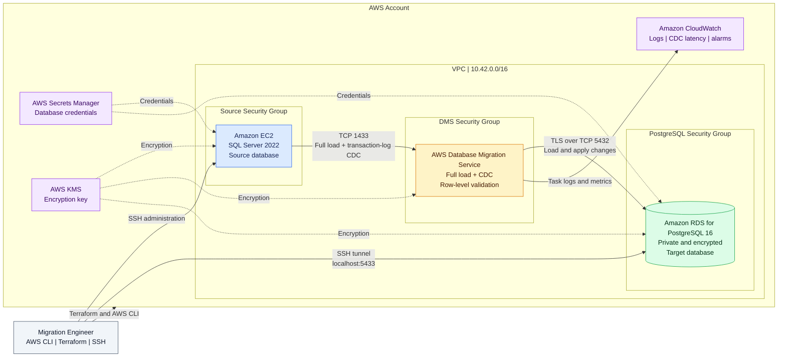

# Migration architecture and evidence

This walkthrough documents the deployed SQL Server-to-PostgreSQL migration path and provides sanitized evidence from the completed AWS DMS lab. All records shown are synthetic.

## AWS architecture

The source accepts SQL Server traffic from the DMS security group. The private PostgreSQL target accepts traffic from DMS and from the EC2 jump host used for administrative SSH tunneling. Secrets Manager supplies credentials, KMS encrypts stored data, and DMS publishes operational logs and latency metrics to CloudWatch.

## AWS DMS deployment

### DMS console

### Endpoint connectivity

Both the SQL Server source and PostgreSQL target endpoints passed their DMS connection tests before migration began.

### Full-load and CDC task

The replication task uses the `full-load-and-cdc` migration type. Full load copies the existing dataset, then CDC continues applying SQL Server transaction-log changes to PostgreSQL.

### DMS audit and operational logging

CloudWatch-backed task logging records migration activity and provides evidence for troubleshooting and operational review.

## Schema conversion evidence

The migration uses an explicitly converted PostgreSQL schema rather than asking DMS to design the target. SQL Server-specific types and naming conventions are mapped to PostgreSQL-compatible equivalents.

## Source and target verification

### Transplant case table

The source and target screenshots demonstrate that the same synthetic transplant cases are available in both database engines after full load.

#### PostgreSQL target

### Diagnostic results and CDC

The diagnostic-result screenshots provide row-level evidence for the migrated workload and the CDC test markers generated by `database/sqlserver/004_demo_cdc_changes.sql`.

#### PostgreSQL target

## Verification outcome

At the final test point:

- Both DMS endpoints reported `successful`.
- Full load reached 100 percent for all five selected tables.
- The task reported zero table errors.
- Insert, update, and delete CDC operations reached PostgreSQL.
- Independent validation reported matching source and target counts.
- The repository test suite passed.

See the [complete workflow](complete-workflow.md) for the operational sequence and the [cutover runbook](cutover-runbook.md) for production-shaped go/no-go criteria.
